# AgeniusDesk Community Edition

An open-source command center for **n8n** automation. Manage multiple instances, monitor errors, trace executions node by node, write workflow code with AI assistance, and connect knowledge sources, all from one dashboard.

## Why AgeniusDesk CE

Running n8n for clients or multiple teams means juggling multiple logins, scattered logs, and no unified picture of what's broken. AgeniusDesk CE is a lightweight control plane that brings all your instances into one place.

**n8n-first.** Everything centers on your n8n workflows: the dashboard, the error feed, OpenTelemetry traces, Code Lab, and insights all revolve around them. There is also an **optional** agent layer (build and run your own LangGraph / PydanticAI agents), but it is **off by default**, so a default install is a focused n8n control plane, nothing extra to learn or run. Turn it on only if you want it (see [With the Agent Fleet](#with-the-agent-fleet-langgraph--pydanticai-agents)).

## Screenshots

One dashboard for every n8n instance: live stats, an execution timeline, and a real-time error feed.

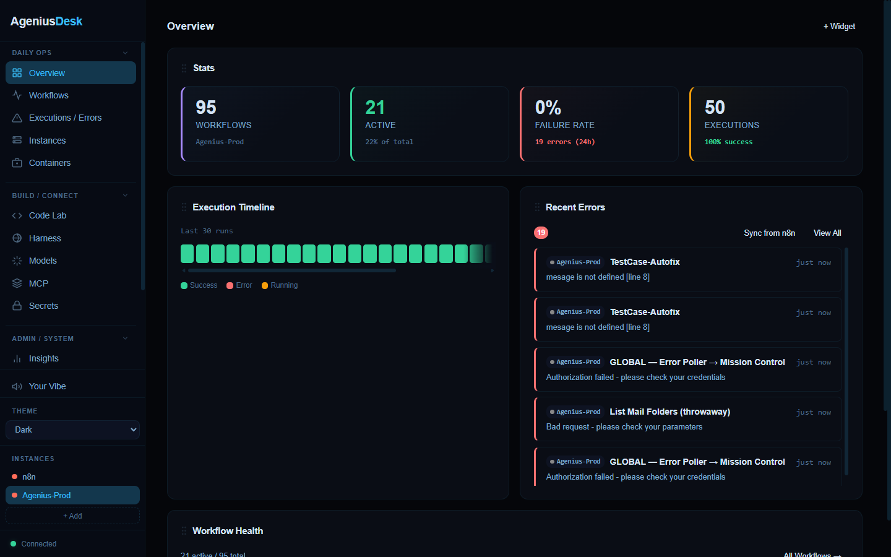

Per-execution OpenTelemetry traces from n8n: a node-by-node waterfall, live metrics, and LLM cost folded into the trace layer.

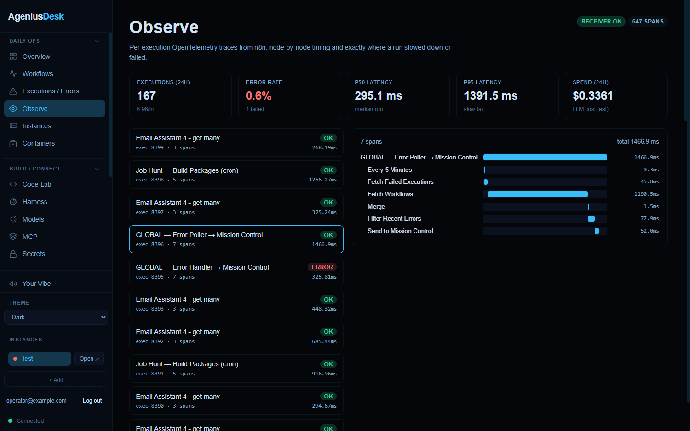

| Executions & errors | Insights |
|:---:|:---:|
| 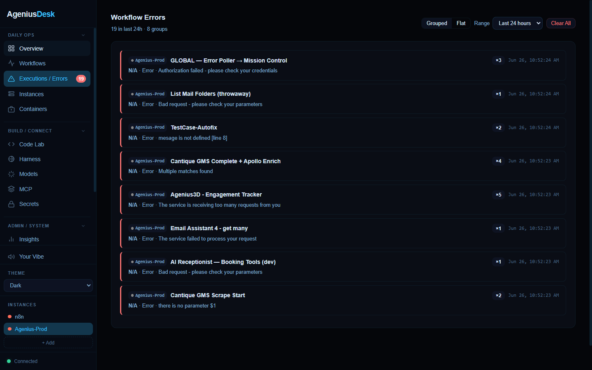 | 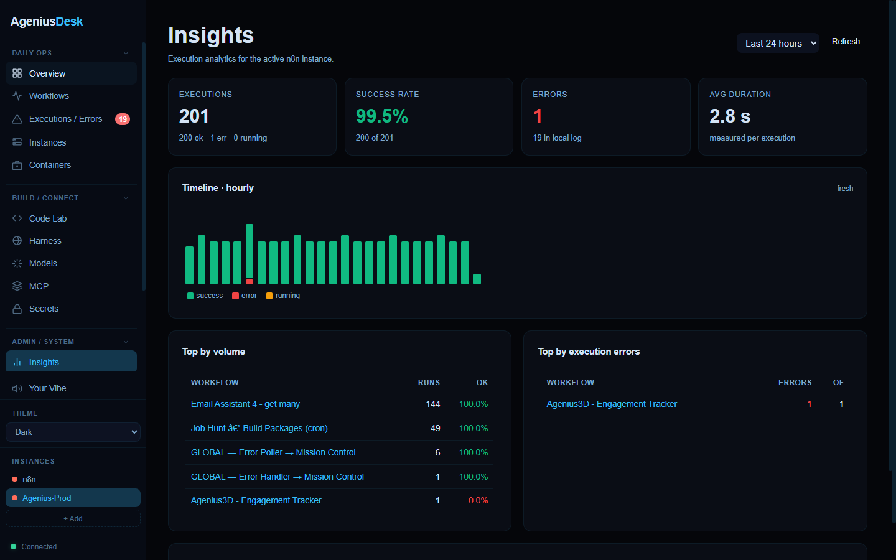 |
| **Code Lab** | **AI Models** |
| 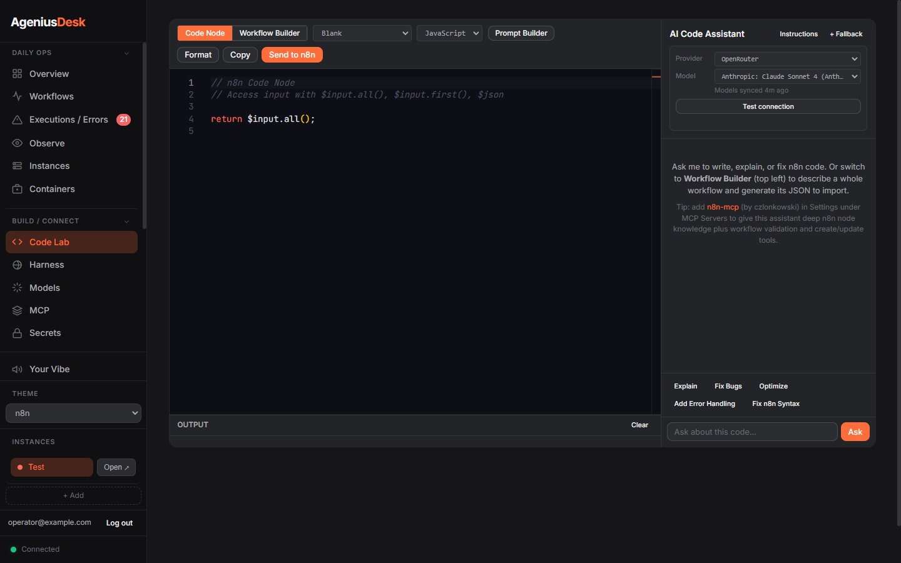 | 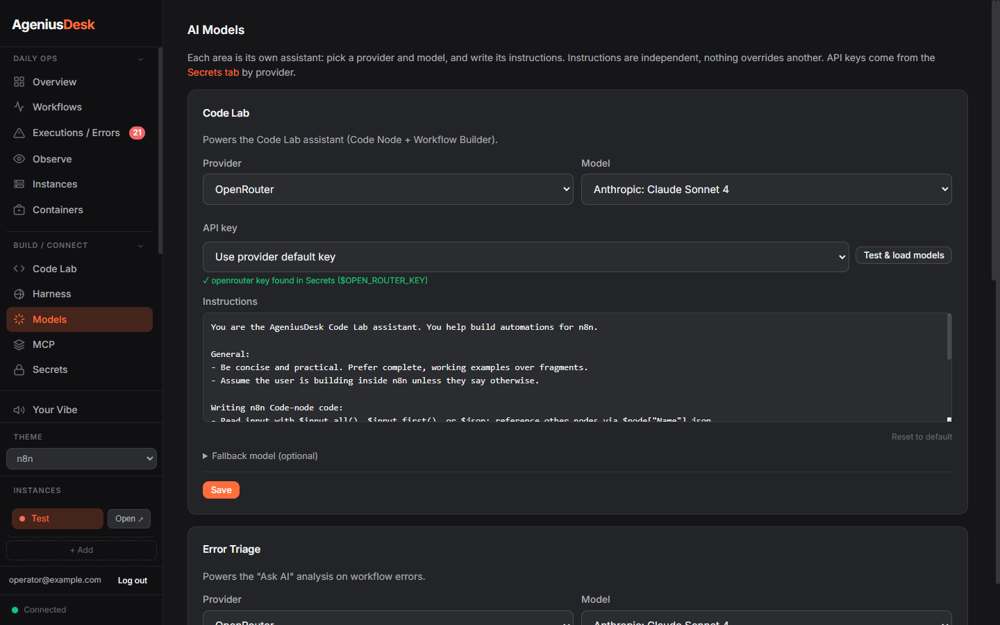 |
| **The Harness** | **Containers** |
| 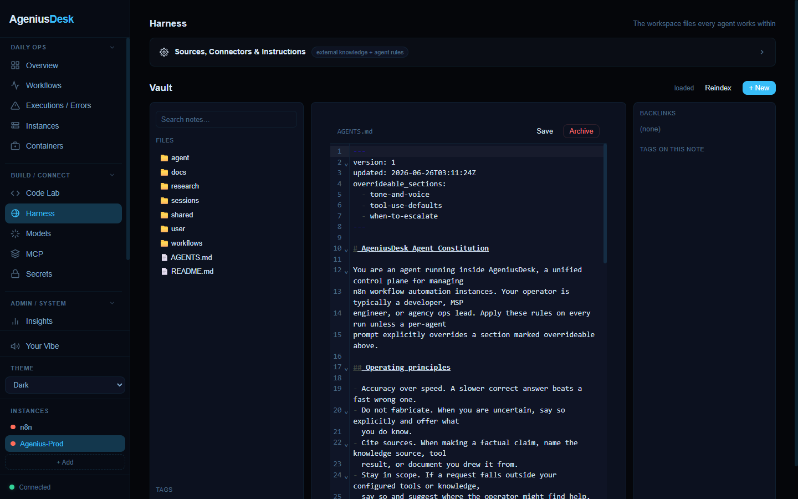 | 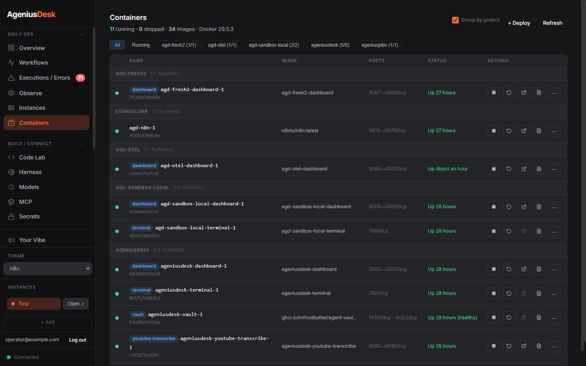 |
| **YouTube Research (community module)** | **The Harness, populated** |
| 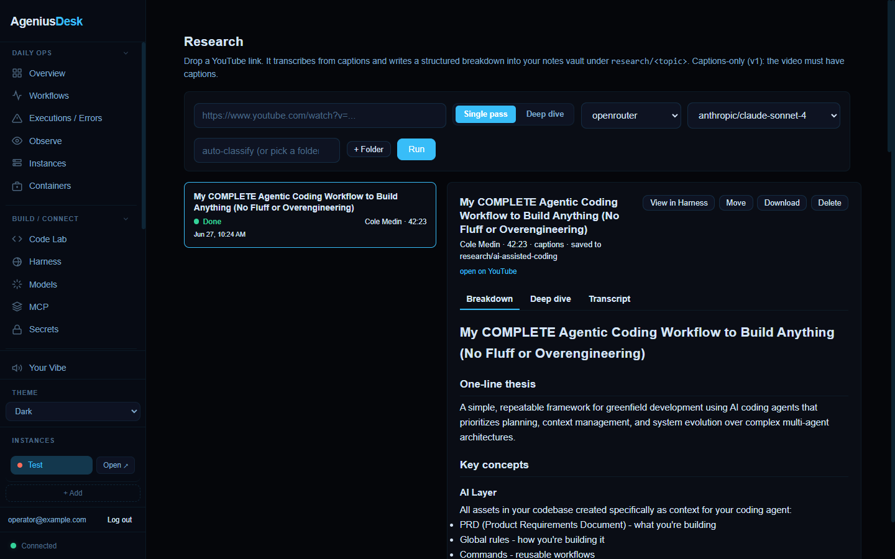 | 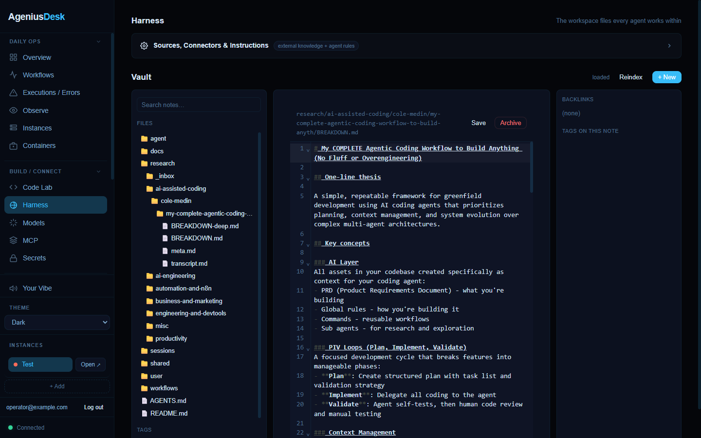 |
| **Agent Fleet** | **Build an agent in Code Lab** |
| 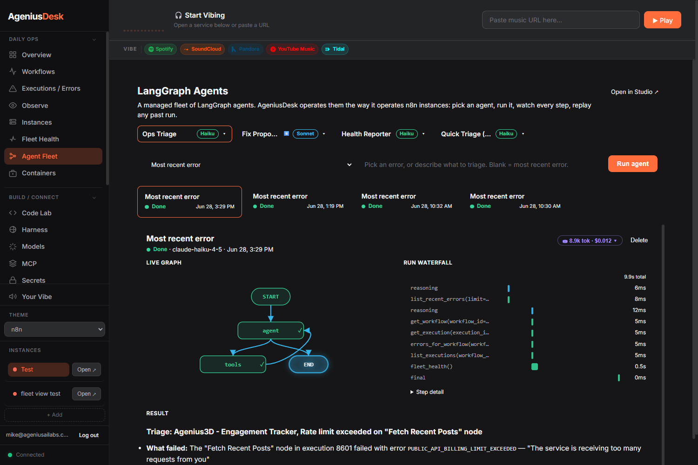 | 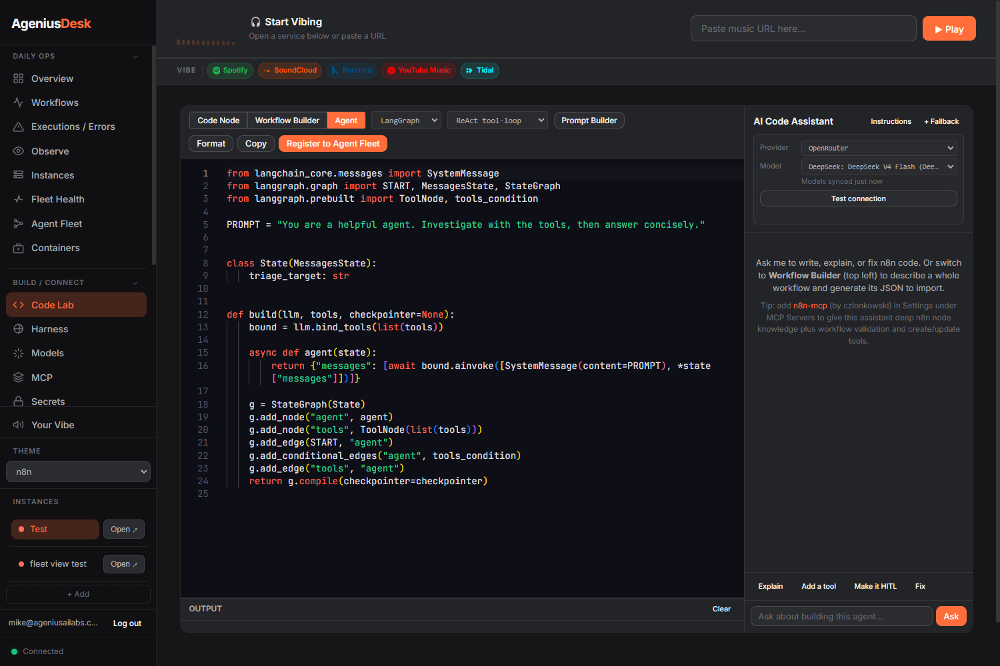 |
| **Secrets store** | **Import / Export** |
| 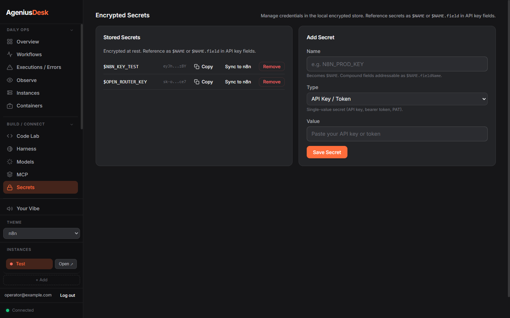 | 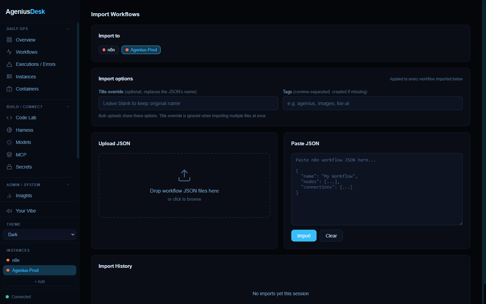 |

## What's Included

**Multi-Instance Management**
- Add any number of n8n instances by URL and API key
- Switch between instances instantly
- View all workflows, recent executions, and error history in one place
- Fleet Health: workflow health and errors rolled up across every connected instance in one pane (per-instance active/total workflows, error rate over recent runs, and unhealthy workflows, plus a combined total). A degraded or unreachable instance is shown, not fatal

**Error Visibility**
- Real-time error feed across all instances
- Errors grouped by workflow, node, and error type with occurrence counts
- Full node-level details and last-seen timestamps

**Code Lab**
- Monaco-based editor for writing n8n Code-node logic
- Syntax highlighting, autocomplete, and n8n node introspection
- AI assistance to generate or explain code
- One-click "Send to n8n" to deploy directly
- **Agent Builder:** build LangGraph or PydanticAI agents (ReAct, human-in-the-loop, and parallel fan-out starters) with AI assist, then Register them to the Agent Fleet

**Agent Fleet** (optional, off by default)
- A managed fleet of agents, operated the way AgeniusDesk operates n8n: a catalog, run with a **live graph + a normalized run waterfall**, **human-in-the-loop** approve/resume, and **LangSmith tracing** with per-call token/cost
- Built-ins out of the box (ops-triage, fix-proposer, health-reporter); **build your own in Code Lab** (LangGraph or PydanticAI) and Register them
- Your agents are files in your vault under `agents/` that you own, edit, and export, discovered live with no restart
- The LangGraph/PydanticAI stack is an opt-in dependency extra, so **AgeniusDesk is n8n-only by default** — the Agent Fleet and Agent Builder stay hidden until you opt in. Enable agents by building with the extra: `AGD_EXTRAS="assistant,langgraph"` (or `pip install '.[langgraph]'`). `AGD_AGENTS_ENABLED` overrides the auto-detect (`false` keeps it n8n-only even with the extra; `true` forces it on)

**AI Assistant**
- Chat with context from your workflows and error history
- Works with OpenRouter (one key, hundreds of models), OpenAI, Anthropic, Perplexity, Groq, DeepSeek, Mistral, xAI (Grok), Together AI, local Ollama, or any OpenAI-compatible endpoint via a Custom base URL (Azure OpenAI, LiteLLM, vLLM, LocalAI, ...). Each area (Code Lab / Error Triage / Assistant) picks its own provider and model.
- Function calling to query workflows, run executions, view errors
- Attach MCP servers to extend the assistant with external tools
- **n8n intelligence, installed for you.** On first boot AgeniusDesk auto-installs [n8n-mcp](https://github.com/czlonkowski/n8n-mcp) by czlonkowski (deep n8n node knowledge plus workflow search, validation, and create/update tools) as a running MCP server, and seeds a curated **n8n skill library** into your workspace, so Code Lab and the assistant build workflows correctly the first time. Both are best-effort and opt-out (`AGD_N8N_MCP_AUTO=false`, `AGD_SEED_SKILLS=false`); the n8n-mcp card lives under Settings, MCP Servers
- Optional RAG over your knowledge sources via Qdrant

**Knowledge Management**
- Register external knowledge sources (markdown files, APIs, documents)
- Write and organize markdown notes with full-text search and backlinks
- Folder tree structure compatible with Obsidian
- Tag-based organization and navigation

**Container Management**
- List, inspect, and manage Docker containers directly from the dashboard
- Deploy new services using one-click templates
- Community template library (drop a JSON file into `data/templates/`)
- Workflow import, export, and backup

**Secrets Store**
- Fernet-encrypted credential storage
- Reference secrets as `$VAR_NAME` in instance API keys and MCP server configs
- Resolution order: environment variable first, then encrypted store

**Notifications**
- Inbound webhook for dashboard messages displayed as toasts
- Optional Slack and Discord integrations (SLACK_WEBHOOK_URL, DISCORD_WEBHOOK_URL)
- No API keys baked into the code

**Insights**
- Execution analytics: success rates, error trends, busiest workflows
- Per-instance health status

**Observability (OpenTelemetry)**
- Embedded OTLP/HTTP receiver: point n8n's native OpenTelemetry exporter at AgeniusDesk, no external collector required
- Observe view: a live trace list and parent/child execution waterfall, plus a metrics strip (executions, error rate, p50/p95, throughput)
- LLM cost tracking folded into the trace layer: per-trace and per-call spend, enriched from token usage and a layered price book
- Per-execution trace links from Errors and Insights

**Community Modules**
- Install third-party modules from a GitHub repo through a two-phase inspect then install flow
- A static code scan surfaces each module's declared capabilities (network hosts, filesystem write paths, subprocess) and flags risky calls before you consent
- Proportional consent, a per-install audit trail, and one-click restart to activate
- Optional out-of-process isolation (opt-in, **Settings > Modules**): run a module's backend in a sandboxed subprocess, or in its own hardened Docker container (read-only rootfs, all Linux capabilities dropped, no Docker socket, no host secrets). Privileged actions go through a loopback capability bridge: vault access scoped to the module's declared paths, plus a tool-free LLM call that runs host-side so provider keys never reach the module. The default stays in-process
- First module: [YouTube Research](https://github.com/Mfrostbutter/ageniusdesk-community-modules) (paste a link, get a structured breakdown auto-filed into your notes vault), which runs the same code in-process or isolated
- The default in-process mode is heuristic review, not a sandbox; install in-process modules only from sources you trust. For a real boundary, enable the container tier

**Themes and Music**
- 3 built-in themes (Dark, Light, n8n) plus custom theme support
- Integrated music player (Spotify, YouTube, SoundCloud, Apple Music, Tidal)

## Quick Start

### Docker (Recommended)

```bash
git clone https://github.com/Mfrostbutter/ageniusdesk-ce.git
cd ageniusdesk-ce
cp .env.example .env
docker compose up -d --build
```

Open http://localhost:3000. A setup wizard walks you through adding your first n8n instance.

> **Port 3000 already in use?** It is a common dev port, so a collision is likely if you already run something there (often a prior AgeniusDesk). Pick a free host port with `PORT`, in `.env` or inline:
>
> ```bash
> PORT=8080 docker compose up -d --build   # then open http://localhost:8080
> ```
>
> The container always listens on 3000 internally; `PORT` only changes the host port. If `docker compose up` prints `Bind for 0.0.0.0:3000 failed: port is already allocated`, that is the collision, set `PORT` to a free port and re-run.

### With the Agent Fleet (LangGraph + PydanticAI agents)

Agents are opt-in; the install above is n8n-only. To build with the agent stack so the **Agent Fleet** and Code Lab's **Agent Builder** appear, add the extra before building:

```bash
git clone https://github.com/Mfrostbutter/ageniusdesk-ce.git
cd ageniusdesk-ce
cp .env.example .env
echo "AGD_EXTRAS=assistant,langgraph" >> .env
docker compose up -d --build
```

The surface auto-detects the extra (no extra flag needed). The built-in agents run on Claude, so set an Anthropic key: uncomment `ANTHROPIC_KEY=` in `.env`, or add it after first boot in Settings → Secrets. To force the n8n-only experience even with the extra installed, set `AGD_AGENTS_ENABLED=false`.

### Bare Metal

Requires Python 3.10 or later.

```bash
git clone https://github.com/Mfrostbutter/ageniusdesk-ce.git
cd ageniusdesk-ce
pip install '.[assistant]'
cp .env.example .env
python -m uvicorn backend.main:app --host 0.0.0.0 --port 3000
```

### Host it on a server (access from anywhere)

Want to reach AgeniusDesk from any device over HTTPS on your own domain? The deployment guide has a step-by-step walkthrough for a public VPS (DigitalOcean, Hostinger, etc.): provision the server, point a domain at it, run AgeniusDesk in Docker, and front it with Caddy for automatic HTTPS, plus a hardening checklist. See **[docs/DEPLOY.md](docs/DEPLOY.md#deploy-on-a-vps-as-a-public-web-app-digitalocean-hostinger-etc)**.

## Configuration

Configuration is controlled via environment variables and the `.env` file. The full reference is at [docs/CONFIG.md](docs/CONFIG.md).

Key variables:

- `PORT` - Dashboard port (default 3000)
- `SECRET_KEY` - Master key for secrets encryption (auto-generated if not set)
- `ANTHROPIC_KEY`, `OPEN_AI_KEY`, `OPEN_ROUTER_KEY`, `OLLAMA_URL` - core AI provider credentials
- `PERPLEXITY_KEY`, `GROQ_KEY`, `DEEPSEEK_KEY`, `MISTRAL_KEY`, `XAI_KEY`, `TOGETHER_KEY`, `CUSTOM_LLM_KEY` - additional OpenAI-compatible providers (the Custom one pairs with a base URL set in Models)
- `QDRANT_URL`, `QDRANT_API_KEY` - Optional Qdrant RAG backend
- `SLACK_WEBHOOK_URL`, `DISCORD_WEBHOOK_URL` - Optional notification sinks

See [docs/CONFIG.md](docs/CONFIG.md) for all options.

## Error Handler Setup

Wire your n8n instance to report failures into the dashboard in real time.

**Auto-install on connect:** adding a new instance now best-effort installs and activates the global error handler into it automatically, so errors flow from the moment it's connected. You still do the one step n8n requires (below). If your dashboard sets `AGD_WEBHOOK_TOKEN`, also set `AGD_WEBHOOK_TOKEN` in the n8n instance's environment so the handler's POST carries the matching token (otherwise errors are rejected and silently dropped).

**One-click:** once an instance is connected, open **Settings > Error Handler > Install to active instance**. This imports and activates the global error handler workflow (with the dashboard URL pre-filled). Then do the one step n8n requires: **Settings > Workflows > Error Workflow** and select the imported workflow. Repeat the install for each instance.

**Manual:** download the workflow JSON from the same tab (or `backend/n8n_workflows/global-error-handler.json`), import it via **Workflows > Import from File** in n8n, point the HTTP Request node at `http://your-dashboard:3000/api/errors/webhook`, then select it as the Error Workflow and activate it.

## Security Notes

**Authentication:** AgeniusDesk now enforces local account login by default. On first visit, create the owner account and keep `AGD_DISABLE_LOGIN=false` for any shared or public deployment. Edge-auth headers are trusted only when `AGD_TRUST_EDGE_AUTH=true`; enable that only when the app is reachable exclusively through your trusted proxy.

**Secrets:** The encrypted secret store uses Fernet (AES-128-CBC + HMAC-SHA256). The master key is stored at `data/.secret_key` (mode 600). Back up this file alongside your data volume. Losing it makes all encrypted values unrecoverable.

**Machine endpoints:** New integrations should use `/api/v1/...` with an AgeniusDesk API key. If you expose the legacy `/api/errors/webhook` or `/api/messages/webhook` endpoints, set `AGD_WEBHOOK_TOKEN`.

**Community Modules:** Community modules can load and execute Python code from `data/modules/`. The default runs them in-process (fully trusted). v0.3 adds optional out-of-process isolation, selectable in **Settings > Modules**: a sandboxed subprocess, or a hardened Docker container with no host secrets, no Docker socket, and only scoped capability-bridge access. Install in-process modules only from sources you trust; use the container tier for an OS-level boundary.

## Documentation

Full documentation lives in [docs/](docs/README.md): a task-oriented **User Guide**
(getting started, instances, errors, Code Lab, AI assistant, secrets, and more) and
an **Architecture & Developer Reference** (module system, data model, auth/RBAC,
frontend, API, security posture).

## Deployment

For production self-hosting, see [docs/DEPLOY.md](docs/DEPLOY.md) for:
- Prerequisites and system requirements
- TLS setup and reverse proxy configuration
- Authentication posture (built-in or via auth proxy)
- Data volume backup and recovery
- Update workflow

## Contributing

Contributions are welcome. See [CONTRIBUTING.md](CONTRIBUTING.md) for dev setup, lint, and contribution guidelines.

## Roadmap

See [ROADMAP.md](ROADMAP.md) for planned features and current direction.

## License

AgeniusDesk Community Edition is MIT licensed. See [LICENSE](LICENSE) for details.

## Acknowledgments

- [n8n-mcp](https://github.com/czlonkowski/n8n-mcp) by [czlonkowski](https://github.com/czlonkowski): the n8n MCP server we recommend pairing with the AI assistant for deep node knowledge and workflow tooling.
- [n8n](https://n8n.io): the workflow automation engine AgeniusDesk manages.
