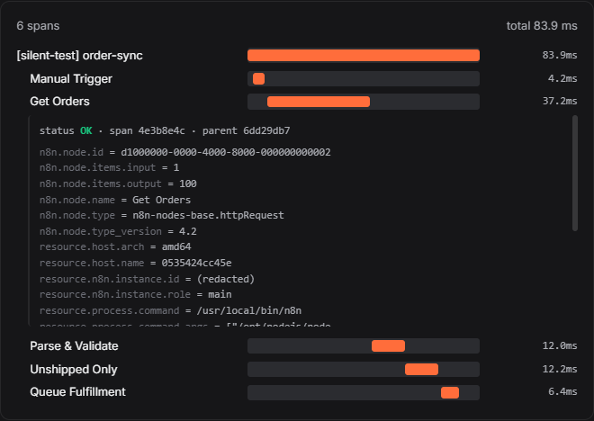
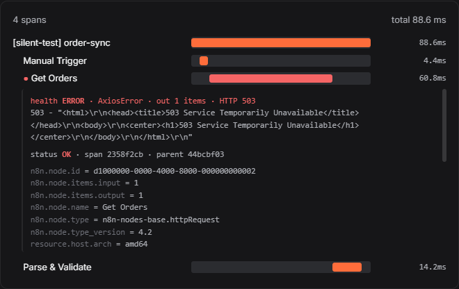
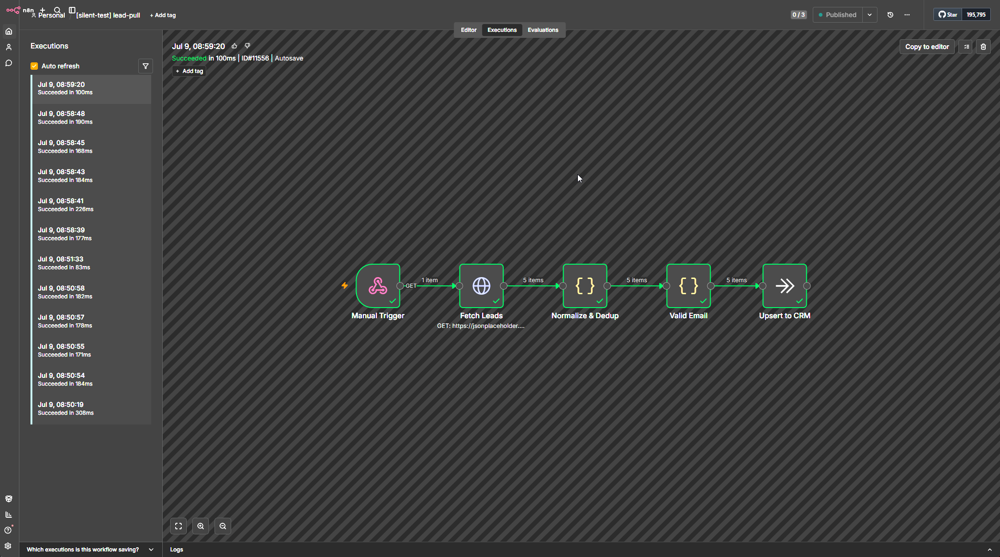
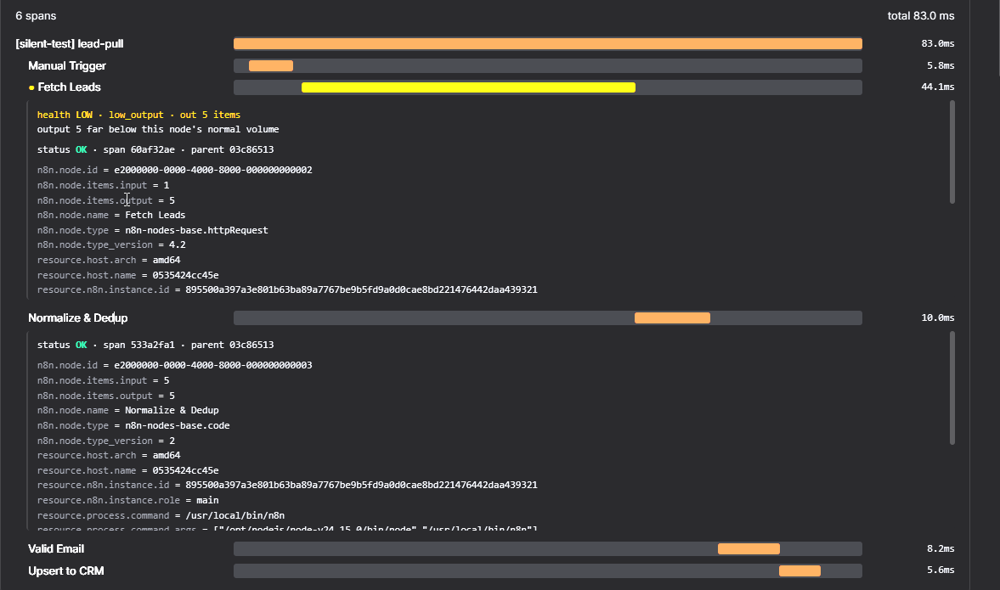
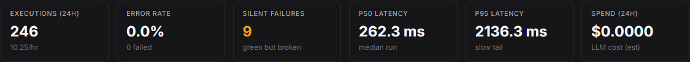
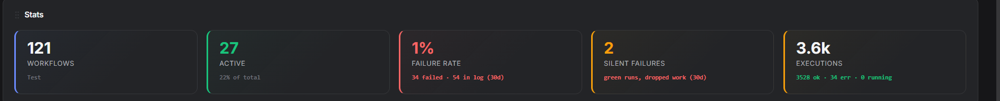
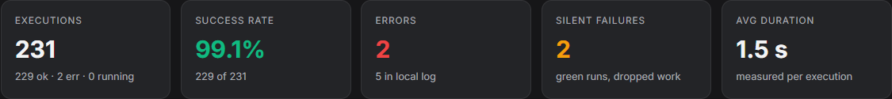

# Silent-failure detection

> An experiment in catching the n8n runs that break without failing.

Continue-On-Fail is one of the most useful settings in n8n and one of the most
dangerous. Turn it on (or wire a node's error output nowhere) and a node that
throws no longer stops the workflow. The run keeps going, finishes, and n8n
records it as **success**. The work the node was supposed to do is simply gone,
and nothing in the execution log says so.

This document is a writeup of how AgeniusDesk detects those runs, why n8n's own
status cannot, and how the detector decides which "green" run is actually broken
without drowning you in false alarms. It is a working experiment, not a finished
science; the open questions are called out at the end.

## The problem: green, but broken

Here is a small, realistic workflow. It fetches orders over HTTP, validates and
normalizes them, filters to the ones that still need fulfillment, and queues
those. On a healthy run it pulls 100 orders, keeps 50, and passes them on.

Now the orders API returns a 503. The HTTP node has Continue-On-Fail enabled (a
very common choice, so one bad upstream call does not nuke the whole run). Watch
what n8n reports:

**Succeeded in 98ms.** Every node has a green check. The HTTP node swallowed the
503 and passed an error item downstream; the validator found nothing valid and
emitted zero; the last two nodes had no input and never ran. Zero orders were
queued. To the execution log, to any dashboard that reads execution status, and
to the operator scanning a list of green runs, nothing happened here worth
looking at. The integration has "just stopped working" with no trail.

This is the single worst failure class in n8n because the usual signal (a failed
execution) never fires.

## Why the status can't catch it

The obvious idea is to read the node's status. It does not work. n8n's native
OpenTelemetry exporter marks a Continue-On-Fail node's span **OK**, because from
the engine's point of view the node did continue successfully. The status lies at
every layer: execution status, node status, span status all say fine.

The truth survives in exactly two places:

1. **The run's data.** The demoted error is still there, moved into the node's
   normal output as an error item. n8n records it inconsistently depending on the
   source (an HTTP failure is an object with a `.status`; a thrown Code error is a
   bare string), but it is recorded.
2. **The item counts.** A node that normally emits N items and now emits 0 (or
   far fewer) is visible in the per-node input/output counts the OTel spans
   already carry, with no extra round-trip.

So the detector ignores status entirely and reads output shape instead.

## The approach: two detectors, split by cost

AgeniusDesk receives n8n's OpenTelemetry traces on an embedded OTLP receiver and,
on ingest, enriches each run with per-node health.

**Demoted error (free-ish).** For each node, union the three places n8n may have
recorded an error: the execution status on the run, a run-level `error` object,
and the item-level `json.error` that Continue-On-Fail pushes into normal output.
Normalize the inconsistent shapes to one `(type, summary, http_status)`. This
needs one run-data fetch per execution, so it is done once and cached.

**Low output (free).** Read `n8n.node.items.output` and `.input` straight off the
span. No round-trip. A zero or a sharp drop is the signal, but only when it is
anomalous for that specific node, which is the whole problem.

A run is a **silent failure** when its top-level status is `success` and yet a
node resolves to `ERROR` or `LOW`.

The clearest way to see it is the same node on two runs. Here is the healthy one:
`Get Orders` reports `status OK` and 100 items out, the whole span reading the way
it should.

Now the broken run in AgeniusDesk's Observe view. n8n still called `Get Orders`
OK; the detector reads the 503 out of the output and marks it `health ERROR`,
with the output collapsed:

## Deciding which zero is a failure

A zero output is not automatically a problem. Plenty of nodes return nothing on a
perfectly healthy run: a poller that checks for new signups and usually finds
none, a filter that legitimately matches nothing this cycle. Alerting on every
zero would produce a firehose of noise, and a noisy alarm gets muted and becomes
worthless. The design rule is **precision over recall**: when unsure, stay quiet.

Each node is classified against its own recent history:

- **Cold start** (not enough history): never fire. We do not know this node's
  normal yet.
- **Intermittent / dormant** (zeros are common for this node): a zero is within
  normal. Stay quiet.
- **Steady producer** (reliably emits data): this is the only class that can
  fire. If it had input and returned **zero**, that is a silent empty. If it
  returned far below its normal band (for example under 10% of its median), that
  is a **magnitude drop**, which catches "200 rows became 3" that a zero-only
  rule would miss.

### Report the origin, not the cascade

When a node returns zero, every node downstream also sees nothing. Firing on all
of them turns one root cause into fifteen alerts. Two rules keep it to one:

- **For a zero:** n8n does not run a node that receives no input, so downstream
  nodes simply do not execute. Only the node that actually went `N -> 0` fires.
- **For a drop:** downstream nodes *do* run, each with a reduced-but-nonzero
  count, so each independently looks low. The detector keeps a per-node **input**
  history alongside the output history: a node whose input is itself anomalously
  low just carried an upstream drop through (a victim) and is suppressed; the
  origin is the node whose input held normal while its output collapsed.

The lead-pull workflow shows the drop path. A query drifted and the API returned
5 rows instead of its usual 500. n8n, again, calls it a success with every node
green:

`Fetch Leads` is flagged as the origin; the three downstream nodes that
faithfully passed 5 through are suppressed:

## Making it loud everywhere

Detection is worthless if it only lives in a trace viewer most operators never
open. A detected silent failure is written into the same errors pipeline that
already drives the Executions/Errors feed, so it surfaces in every view, as its
own distinct class rather than lumped in with ordinary errors.

The Observe metrics strip counts them directly:

The Overview gets a dedicated stat card:

And Insights carries the matching tile, so the analytics page and the home
dashboard always agree:

In the Executions/Errors feed each one renders with a `SILENT` badge and a jump
straight to its trace.

## Configuration

The classifier is tunable per instance. Defaults are conservative on purpose.

| Variable | Default | Meaning |
|---|---|---|
| `AGD_HEALTH_MIN_SAMPLES` | 20 | Runs of history before a node can be judged (cold-start floor) |
| `AGD_HEALTH_STEADY_ZERO_RATE` | 0.05 | A node is a "steady producer" only if it is this rarely empty |
| `AGD_HEALTH_DORMANT_ZERO_RATE` | 0.95 | Above this zero rate a node is treated as dormant (never fires) |
| `AGD_HEALTH_DROP_FACTOR` | 0.1 | Output under `median * this` counts as a magnitude drop |
| `AGD_HEALTH_WINDOW` | 200 | How many recent runs form a node's baseline |

Detection only works once n8n is exporting OpenTelemetry to AgeniusDesk. See the
[README](../../README.md#enabling-opentelemetry-on-your-n8n) for the exporter
setup (instances AgeniusDesk provisions are auto-wired; existing instances you
connect by URL need it enabled once).

## Open questions and limits

This is an experiment, and it has rough edges worth naming:

- **Enrichment latency.** Span-only anomalies (the LOW/drop path) surface the
  moment spans land. The demoted-error path needs a run-data fetch, so a
  Continue-On-Fail HTTP error can lag the execution by up to about a minute
  before it appears. Both still land loud.
- **History poisoning.** A node that fails often enough teaches the classifier
  that being empty is normal for it, and it stops firing. That is correct
  precision behavior, but it means a chronically half-broken node can go quiet.
- **Dead-man's switch.** A node that was supposed to run and did not run at all
  (never produced a span) is not yet detected. That is the natural next detector.
- **Per-node overrides.** Some nodes should always be treated as must-produce, and
  some pollers should always be ignored, regardless of what history infers. A
  per-node override is the obvious escape hatch for the cases history cannot know.

Feedback and counter-examples are welcome. The goal is a silent-failure alarm
trustworthy enough that a green run you did not get paged about is actually fine.
