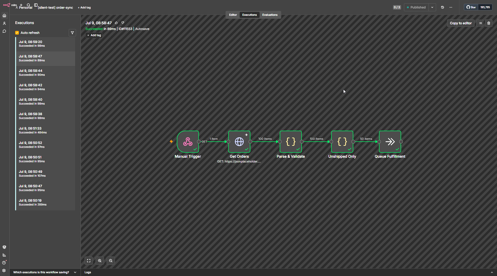
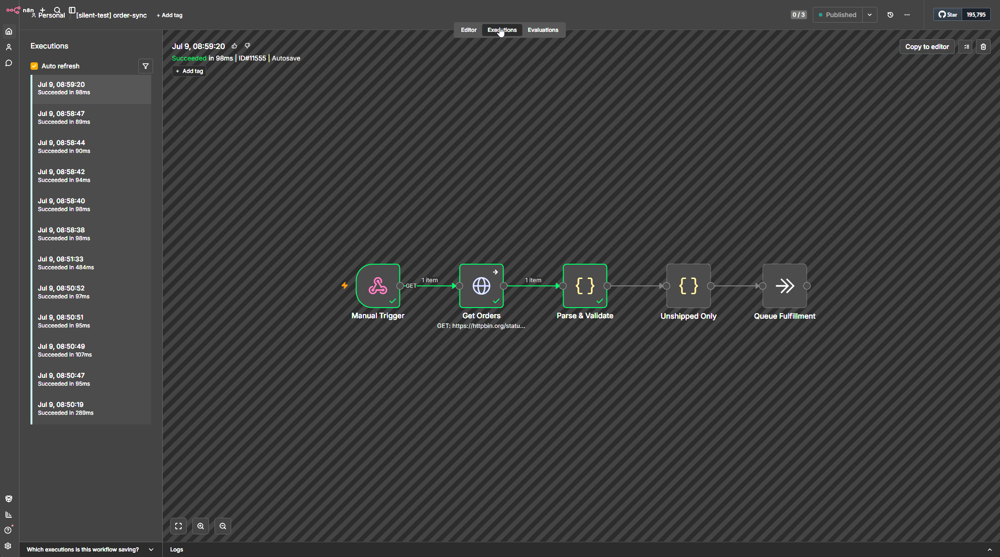
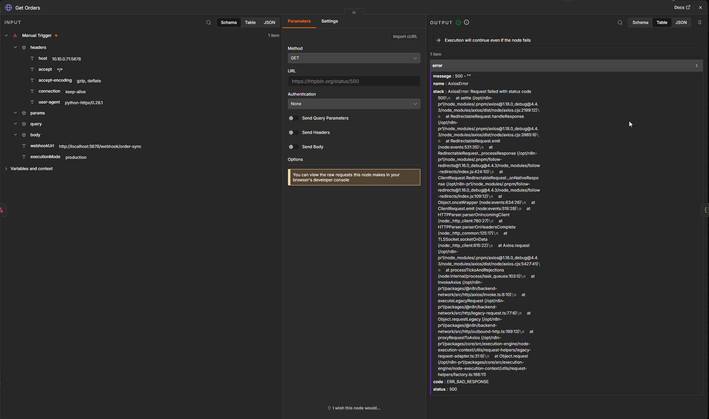
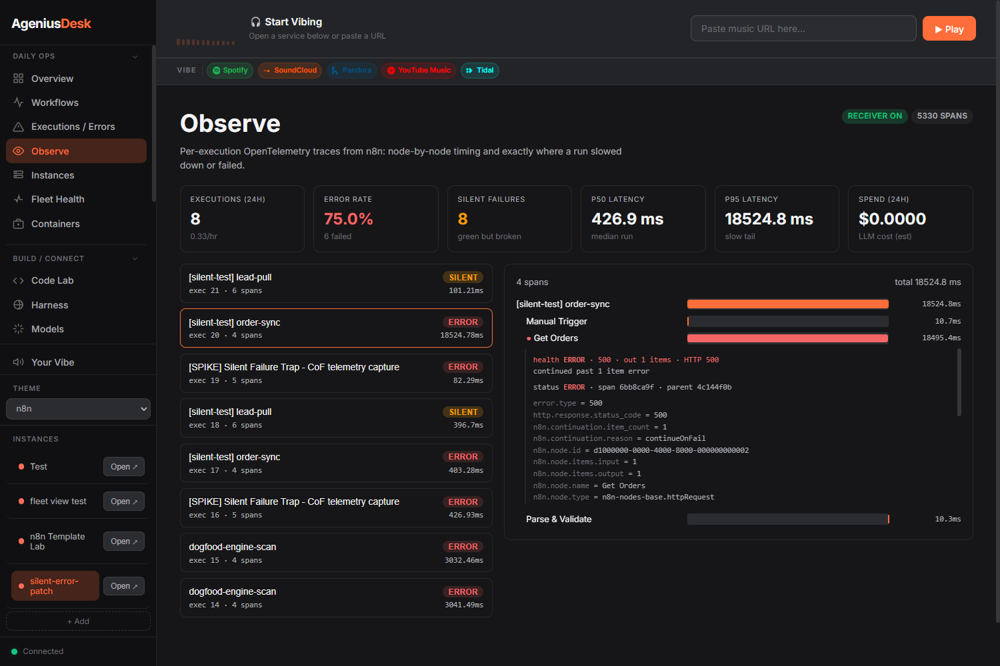
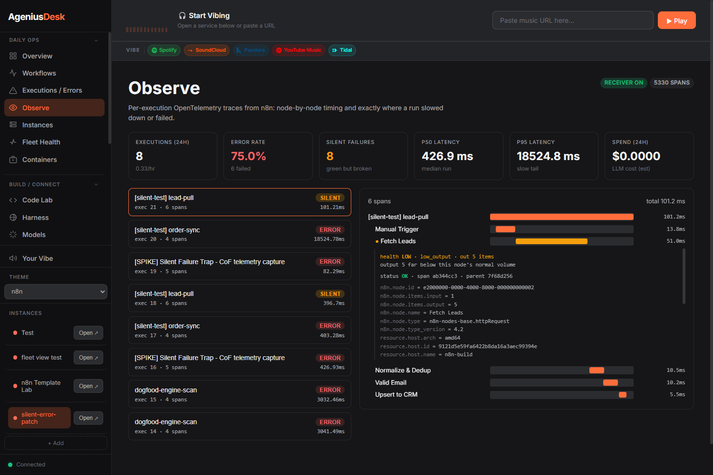
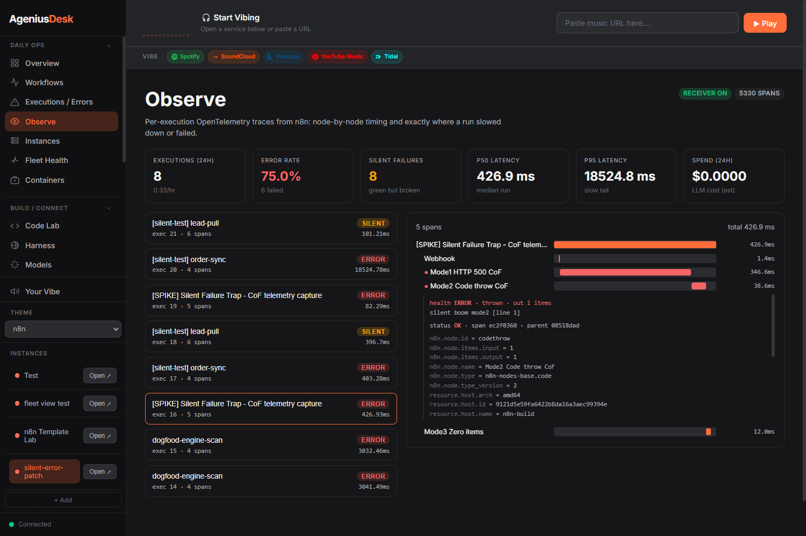
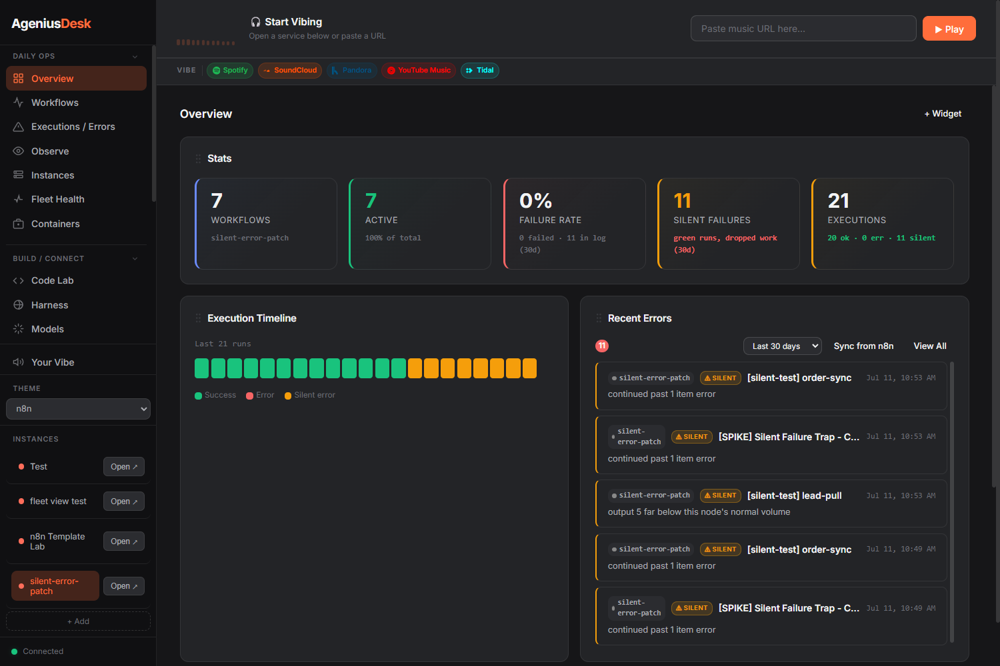

# Silent-failure detection

> An experiment in catching the n8n runs that break without failing.

Continue-On-Fail is one of the most useful settings in n8n and one of the most
dangerous. Turn it on (or wire a node's error output nowhere) and a node that
throws no longer stops the workflow. The run keeps going, finishes, and n8n
records it as **success**. The work the node was supposed to do is simply gone,
and nothing in the execution log says so.

This document is a writeup of how AgeniusDesk detects those runs, why n8n's own
status cannot, and how the detector decides which "green" run is actually broken
without drowning you in false alarms. It is a working experiment, not a finished
science; the open questions are called out at the end.

Since the first version of this writeup the detector gained a second, sounder
signal. n8n does not expose the continued error on its OpenTelemetry span, so we
patched n8n to emit it, and AgeniusDesk now prefers that typed signal over the
heuristic it started with. This is a **cross-program initiative**: an upstream
n8n core patch plus the AgeniusDesk feature that consumes it. This doc covers the
consumer; the patch and the research live in `research-vault`.

## The problem: green, but broken

Here is a small, realistic workflow. It fetches orders over HTTP, validates and
normalizes them, filters to the ones that still need fulfillment, and queues
those. On a healthy run it pulls 100 orders, keeps 50, and passes them on.

Now the orders API returns a 500. The HTTP node has Continue-On-Fail enabled (a
very common choice, so one bad upstream call does not nuke the whole run). Watch
what n8n reports:

**Succeeded.** Every node has a green check. The HTTP node swallowed the error
and passed it downstream as a data item; the validator found nothing valid and
emitted zero; the last two nodes had no input and never ran. Zero orders were
queued. To the execution log, to any dashboard that reads execution status, and
to the operator scanning a list of green runs, nothing happened here worth
looking at. The integration has "just stopped working" with no trail.

The error is not lost, though. It is sitting right there in the node's output,
demoted from an exception to an ordinary item. Open the node and n8n shows it to
you plainly, under a banner that literally says the run will continue anyway:

That output item is the whole game. The run is green, but the node's own output
says `AxiosError`, `status 500`. This is the single worst failure class in n8n
because the usual signal (a failed execution) never fires, while the evidence is
right there in the data the entire time.

## Why the status can't catch it

The obvious idea is to read the node's status. It does not work. n8n's native
OpenTelemetry exporter marks a Continue-On-Fail node's span **OK**, because from
the engine's point of view the node did continue successfully. The status lies at
every layer: execution status, node status, span status all say fine.

The truth survives in three places, in order of how trustworthy it is:

1. **A typed continued-error rollup**, but only if n8n emits one. Stock n8n does
   not. A **patched** n8n (our upstream contribution) records
   `taskData.continuation` on the run and `n8n.continuation.*` on the span
   whenever a node actually swallowed a per-item error under Continue-On-Fail.
   This is the sound signal, and it is new.
2. **The run's data.** On any n8n, the demoted error is still in the node's
   normal output as an error item. n8n records it inconsistently depending on the
   source (an HTTP failure is an object with a `.status`; a thrown Code error is a
   bare string), but it is recorded.
3. **The item counts.** A node that normally emits N items and now emits 0 (or
   far fewer) is visible in the per-node input/output counts the OTel spans
   already carry, with no extra round-trip.

So the detector ignores status entirely and reads these instead.

## The approach: read the signal, not the status

AgeniusDesk receives n8n's OpenTelemetry traces on an embedded OTLP receiver and,
on ingest, enriches each run with per-node health. Two detectors do the work,
split by cost.

### Detector 1: the demoted error (one run-data fetch)

The continued error has no honest span status, so for each execution AgeniusDesk
fetches the run-data once and reads it in priority order, sound signal first:

1. **The typed continuation rollup** (`taskData.continuation`) a patched n8n
   records. The engine only folds a node's typed error marker into it, never a
   loose `error` field a node emitted on purpose, so it fires on a real swallow
   and stays quiet otherwise. **Preferred whenever present.**
2. **An explicit node error** (`executionStatus == "error"` or a run-level
   `error` object) that n8n set itself. Always sound.
3. **An item-level `json.error` content-scan.** The original heuristic: walk the
   node's output items and look for an `error` field. This catches loose-emitter
   nodes (a Code node that returns `{ error: ... }` on a caught exception) that
   the engine rollup cannot see, but it is **unsound** because a node that
   legitimately outputs a field named `error` trips it. It is gated behind
   `AGD_HEALTH_SCAN_LOOSE_JSON_ERROR` and only consulted when the sound signals
   above are silent.

Whatever fires is normalized to one `(type, summary, http_status)` shape.

On a patched instance the payoff is visible in the trace. Here is the order-sync
run from above in AgeniusDesk's Observe view. n8n called `Get Orders` OK; the node
carries the typed continuation marker (`n8n.continuation.reason = continueOnFail`),
and the detector reads it as `health ERROR`, HTTP 500, "continued past 1 item
error", on a run n8n reported as success:

This is the same 500 the n8n node output showed two figures up, now caught
automatically off the telemetry, with no human opening the node.

### Detector 2: low output (free, span-only)

Read `n8n.node.items.output` and `.input` straight off the span. No round-trip. A
zero or a sharp drop is the signal, but only when it is anomalous for that
specific node, which is the whole problem below.

A run is a **silent failure** when its top-level status is `success` and yet a
node resolves to `ERROR` (from Detector 1) or `LOW` (from Detector 2).

## Deciding which zero is a failure

A zero output is not automatically a problem. Plenty of nodes return nothing on a
perfectly healthy run: a poller that checks for new signups and usually finds
none, a filter that legitimately matches nothing this cycle. Alerting on every
zero would produce a firehose of noise, and a noisy alarm gets muted and becomes
worthless. The design rule is **precision over recall**: when unsure, stay quiet.

Each node is classified against its own recent history:

- **Cold start** (not enough history): never fire. We do not know this node's
  normal yet.
- **Intermittent / dormant** (zeros are common for this node): a zero is within
  normal. Stay quiet.
- **Steady producer** (reliably emits data): this is the only class that can
  fire. If it had input and returned **zero**, that is a silent empty. If it
  returned far below its normal band (for example under 10% of its median), that
  is a **magnitude drop**, which catches "200 rows became 3" that a zero-only
  rule would miss.

### Report the origin, not the cascade

When a node returns zero, every node downstream also sees nothing. Firing on all
of them turns one root cause into fifteen alerts. Two rules keep it to one:

- **For a zero:** n8n does not run a node that receives no input, so downstream
  nodes simply do not execute. Only the node that actually went `N -> 0` fires.
- **For a drop:** downstream nodes *do* run, each with a reduced-but-nonzero
  count, so each independently looks low. The detector keeps a per-node **input**
  history alongside the output history: a node whose input is itself anomalously
  low just carried an upstream drop through (a victim) and is suppressed; the
  origin is the node whose input held normal while its output collapsed.

The lead-pull workflow shows the drop path. A query drifted and the API returned
5 rows instead of its usual 500. n8n calls it a success with every node green;
AgeniusDesk flags `Fetch Leads` as the origin (`health LOW`, `out 5 items`, "far
below this node's normal volume") while the downstream nodes that faithfully
passed 5 through stay quiet:

## The coverage boundary

The two signals do not overlap perfectly, and the gap is worth naming because it
decides what a patched instance can safely turn off.

A single test workflow trips three failure modes at once: an HTTP node that
swallows a 500, a Code node that throws and swallows it, and a Code node that
emits zero items. On a patched instance AgeniusDesk catches all three, but by
different signals:

- **Mode 1, HTTP Continue-On-Fail.** The engine folds this into the typed
  continuation rollup, so it is caught by the sound signal and the span carries
  `n8n.continuation.*`. Independent of any flag.
- **Mode 2, Code node throw.** Notice the Code node reads `status OK` but
  `health ERROR, thrown`. Code nodes run in n8n's **task runner**, a separate
  process the engine's continuation collector cannot instrument, so no
  continuation marker is emitted. The only thing catching this is the item-level
  content-scan. Turn `AGD_HEALTH_SCAN_LOOSE_JSON_ERROR` off and this node goes
  dark.
- **Mode 3, zero items.** No error anywhere, just an empty output, handled by the
  low-output classifier as informational unless the node is a steady producer.

So on a **patched** instance you can turn the content-scan off to drop its false
positives (nodes that legitimately output an `error` field), at the cost of
Code-node Continue-On-Fail coverage until the nodes-base marker migration lands
upstream. On **stock** n8n you leave it on for full recall. The default is on.

## Making it loud everywhere

Detection is worthless if it only lives in a trace viewer most operators never
open. A detected silent failure is written into the same errors pipeline that
already drives the Executions/Errors feed, as its own distinct class rather than
lumped in with ordinary errors, so it surfaces in every view.

The Overview pulls it together: a **Silent Failures** stat card, an **Execution
Timeline** that renders green-but-broken runs as their own amber block next to
the green successes and red errors, and a **Recent Errors** feed where each
silent run reads its cause in plain language ("continued past 1 item error", "far
below this node's normal volume"):

The same count carries into the Observe metrics strip and the Insights tiles, and
in the Executions/Errors feed each one renders with a `SILENT` badge and a jump
straight to its trace, so the analytics page and the home dashboard always agree.

## A note on attribution

Enrichment fetches run-data from n8n's API, which means it has to fetch from the
**right** n8n. n8n's OTLP export identifies its source only by an opaque instance
hash, so early on every trace fell back to whichever instance was active and the
cost and health lookups quietly failed against a foreign execution. That is fixed:
traces are now attributed to their source instance and enrichment fetches from the
owning one. The mechanism has its own writeup in
[instance-attribution.md](instance-attribution.md).

## Configuration

The classifier is tunable per instance. Defaults are conservative on purpose.

| Variable | Default | Meaning |
|---|---|---|
| `AGD_HEALTH_SCAN_LOOSE_JSON_ERROR` | `true` | Consult the item-level `json.error` content-scan when no sound signal fired. On = full recall on stock n8n. Off = patched instances drop the false positives (and Code-node CoF coverage). |
| `AGD_HEALTH_MIN_SAMPLES` | 20 | Runs of history before a node can be judged (cold-start floor) |
| `AGD_HEALTH_STEADY_ZERO_RATE` | 0.05 | A node is a "steady producer" only if it is this rarely empty |
| `AGD_HEALTH_DORMANT_ZERO_RATE` | 0.95 | Above this zero rate a node is treated as dormant (never fires) |
| `AGD_HEALTH_DROP_FACTOR` | 0.1 | Output under `median * this` counts as a magnitude drop |
| `AGD_HEALTH_WINDOW` | 200 | How many recent runs form a node's baseline |

Detection only works once n8n is exporting OpenTelemetry to AgeniusDesk. See the
[README](../../README.md#enabling-opentelemetry-on-your-n8n) for the exporter
setup (instances AgeniusDesk provisions are auto-wired; existing instances you
connect by URL need it enabled once). The typed continuation signal additionally
requires the patched n8n; without it the content-scan carries the demoted-error
load.

## Open questions and limits

This is an experiment, and it has rough edges worth naming:

- **Code-node Continue-On-Fail is content-scan only.** As the coverage boundary
  shows, a Code node that swallows a throw is invisible to the sound engine
  signal because it runs in the task runner. Until the nodes-base marker
  migration lands upstream, a patched instance running with the content-scan off
  will miss it. Demonstrated live, not theoretical.
- **Enrichment latency.** Span-only anomalies (the LOW/drop path) surface the
  moment spans land. The demoted-error path needs a run-data fetch, so a
  Continue-On-Fail error can lag the execution by up to about a minute before it
  appears. Both still land loud.
- **History poisoning.** A node that fails often enough teaches the classifier
  that being empty is normal for it, and it stops firing. That is correct
  precision behavior, but it means a chronically half-broken node can go quiet.
- **Dead-man's switch.** Half done. A node that never produced a span is now
  caught *inside a run that did fire*: on a completed green run the detector diffs
  the workflow's declared nodes against the spans that landed and flags one that
  had input available but did not run and that historically runs (graph-aware, so
  a legitimate cascade skip is not flagged; gated on run-history for precision;
  `AGD_HEALTH_DEADMAN_*`). Because a missing node has no span, it surfaces in the
  errors feed rather than on the span timeline. The other half, a workflow that
  never fired at all (schedule missed, instance down), is invisible from inside
  n8n and needs an external heartbeat. Still open.
- **Per-node overrides.** Some nodes should always be treated as must-produce, and
  some pollers should always be ignored, regardless of what history infers. A
  per-node override is the obvious escape hatch for the cases history cannot know.

Feedback and counter-examples are welcome. The goal is a silent-failure alarm
trustworthy enough that a green run you did not get paged about is actually fine.
